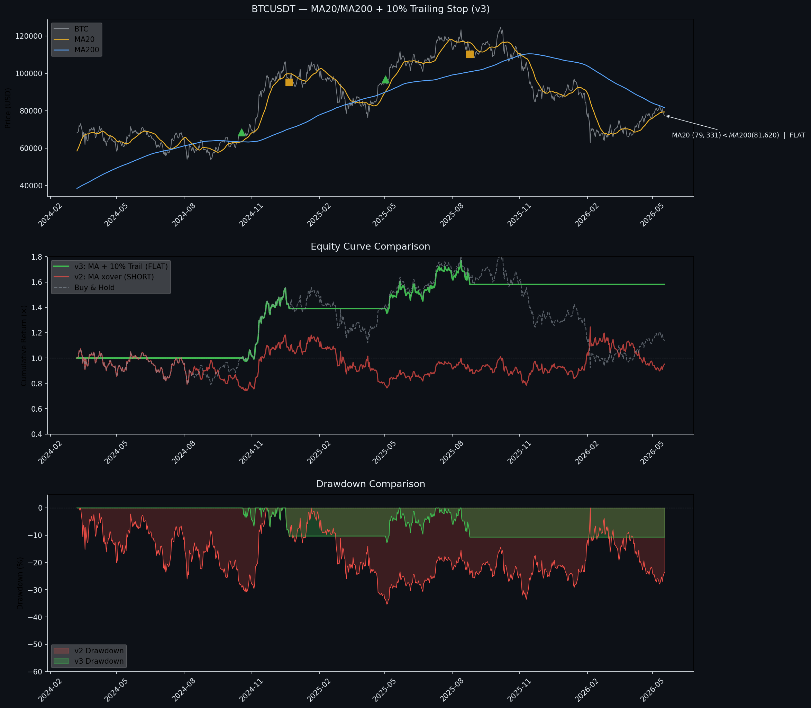

# BTC MA20/MA200 Momentum Backtest — v3

**Live signal (May 22, 2026):** MA20 below MA200 → **FLAT**  
**BTC:** ~$77,452 | **Position:** Cash since Aug 25, 2025 trailing stop exit  
**Watch:** Monitoring for golden cross

---

## Core Finding: Shorting Destroys Returns

Two methods, same MA crossover entries, same data — only the exit logic differs:

### Performance Comparison (Mar 13, 2024 → May 22, 2026)

| Strategy | Total Return | Max Drawdown | Sharpe |
|---|---|---|---|
| **v3: MA + 10% Trail (FLAT)** 🔥 | **+58.09%** | **-12.73%** | **+1.062** |
| v2: MA xover (SHORT) | -11.31% | -35.32% | +0.148 |
| Buy & Hold | +5.99% | -49.53% | +0.318 |

---

## Why Shorting Fails (v2 Breakdown)

| Period | Position | BTC Move | Strategy Effect |
|---|---|---|---|
| Mar 13 – Oct 17, 2024 | Mostly LONG | $73K → $67K (-7.7%) | **-27.93%** — volatility drag in choppy drift-down |
| Oct 18 – Mar 22, 2025 | LONG (Trade 1) | $68K → $84K (+22.5%) | **+20.70%** ✅ |
| Mar 23 – May 1, 2025 | SHORT | $86K → $96K (+12.1%) | **-15.49%** — forced short during counter-trend rally |
| May 2 – Nov 4, 2025 | LONG (Trade 2) | $97K → $101K (+4.8%) | **+4.33%** ✅ |
| Nov 5 – May 22, 2026 | SHORT | $104K → $77K (-25.4%) | **+15.65%** ✅ |

Both long trades were profitable (+20.7%, +4.3%), and the post-Nov 2025 short was profitable (+15.7%). But the two loss periods were catastrophic enough to produce an overall **-11.31%** loss vs **+5.99%** buy & hold.

**Worst offender — Mar–Oct 2024:** BTC drifted down -7.7%, but the strategy lost -27.9%. MA20 stayed above MA200 the whole time (position = LONG), while BTC slowly bled from $73K to $67K through 7 months of choppy sideways action. The daily compounding of small losses in a volatile drift-down destroyed more value than BTC's net decline.

### Why the MA200 Couldn't React — Structural Lag

The MA200 crossover strategy failed to exit in Mar–Oct 2024 because of inherent MA200 lag:

```
Mar 2024:  MA20 ≈ $68K  >  MA200 ≈ $44K  — massive gap
           MA200 still averaging prices from Sep 2023 ($25K)

By Aug:    MA20 ≈ $62K  ≈  MA200 ≈ $62K  — finally met
           Death cross on Aug 13, 2024
```

The MA200 was weighed down by sub-$30K prices from late 2023 — taking 200 days for those low prices to roll off. During those 200 days, BTC drifted from $73K → $67K while the signal stubbornly said "LONG" because the MA200 was too slow to reflect the new reality. This structural lag is why the trailing stop was such a large improvement — it exits based on price action rather than waiting for a 200-day average to confirm what happened months ago.

---

## v3 Fix: Trailing Stop + Cash

v3 eliminates both problems:
- **No shorting** — stays flat when MA20 < MA200 rather than going short
- **10% trailing stop** — exits early based on price action rather than MA cross

### v3 Trade Log

| Date | Action | Price | PnL | Exit Reason |
|------|--------|-------|-----|-------------|
| 2024-10-18 | BUY | $68,428 | — | Golden cross |
| 2024-12-22 | SELL | $95,186 | **+39.10%** | Trailing stop (10%) |
| 2025-05-02 | BUY | $96,887 | — | Golden cross |
| 2025-08-25 | SELL | $110,112 | **+13.65%** | Trailing stop (10%) |

Both exits triggered by the trailing stop — the MA death cross never fired.

---

## Strategy Logic (v3 — Current)

```
Entry:  MA20 crosses ABOVE MA200 → BUY (golden cross)
Exit:   Close drops 10% below highest close since entry → SELL (trailing stop)
         — OR —
        MA20 crosses BELOW MA200 → SELL (death cross, backup)

When MA20 < MA200: Stay FLAT (cash). Do NOT short.
The trailing stop ratchets UP only — never down.
```

---

## Charts



---

## Version History

| Version | Date | Key Change | Return | MaxDD | Sharpe | Verdict |
|---------|------|-----------|--------|-------|--------|---------|
| **v3** | May 22, 2026 | 10% trailing stop + FLAT (no shorting) | **+58.09%** | **-12.73%** | **+1.062** | ✅ Best |
| v2 | May 11, 2026 | Walk-forward + full metrics (SHORT) | -11.31% | -35.32% | +0.148 | ❌ Shorting fails |
| v1 | May 9, 2026 | Initial MA crossover (SHORT) | +0.55% | -35.32% | -0.036 | 🏁 Baseline |

---

## BTC vs Gold (PAXG) Correlation — May 2026 Update

BTC vs PAXG (1 PAXG ≈ 1 troy oz physical gold) on Binance daily data (Aug 2023 → May 2026).

### By Regime

| Regime | Days | BTC | PAXG | Price Corr | Return Corr |
|---|---|---|---|---|---|
| **Pre-ATH Rally** (→ Oct 6, 2025) | 772 | +377.6% | +109.8% | **+0.909** | +0.070 |
| **Post-ATH Drawdown** (Oct 7 → Apr 9, 2026) | 186 | -39.9% | +18.3% | **-0.752** | +0.297 |
| **Post-Ceasefire** (Apr 10 → May 22, 2026) | 42 | +5.9% | -4.5% | -0.206 | +0.389 |

### Key Findings

**Regime 1 — Pre-ATH Rally:** BTC and gold moved together (+0.909 price correlation). Both were running on the same macro driver — loose monetary policy, ETF inflows, global liquidity. This is the "everything rally" regime.

**Regime 2 — Post-ATH Drawdown:** BTC crashed -40% while gold gained +18%. The correlation flipped to **-0.752** — they moved in opposite directions. This is the clearest evidence yet that BTC is NOT "digital gold" during a crisis: BTC behaved like a risk asset, gold behaved like a safe haven.

**Regime 3 — Post-Ceasefire (NEW, 42 days):** BTC +5.9% while PAXG -4.5% — classic **risk-on recovery**. BTC and gold are diverging again as appetite returns to risk assets. Return correlation of +0.389 means they still share some macro sensitivity day-to-day, but the direction of travel is opposite. This is NOT an inflation hedge signal — gold falling while BTC rises is the "risk appetite returning" trade.

**Full period conclusion:** BTC's relationship with gold is regime-dependent. They rally together in risk-on (+0.91), diverge violently in risk-off (-0.75), and diverge again in recovery (-0.21). The "BTC as digital gold" thesis only holds during synchronized macro rallies — it fails completely during drawdowns.

---

## Related: CVD Backtest (Separate Repo)

CVD was tested as both entry and exit filter across 3 versions — [btc-cvd-backtest](https://github.com/JonathanHo011/btc-cvd-backtest). Rejected for daily spot BTC.

---

## Files

| File | Description |
|------|-------------|
| `run_backtest_v3.py` | Current (v3) — trailing stop + flat, includes v2 comparison |
| `run_backtest_v2.py` | Historical — original MA crossover with walk-forward |
| `btc_gold_corr.py` | BTC vs PAXG correlation by regime |
| `btc_backtest_v3.png` | v3 chart output |
| `btc_backtest_complete.png` | v2 chart output (historical) |
| `btc_price_data.csv` | Latest Binance data |

---

## Setup

```bash
pip install pandas matplotlib requests
python run_backtest_v3.py
```

## Data Source

Binance public API — no key required.
