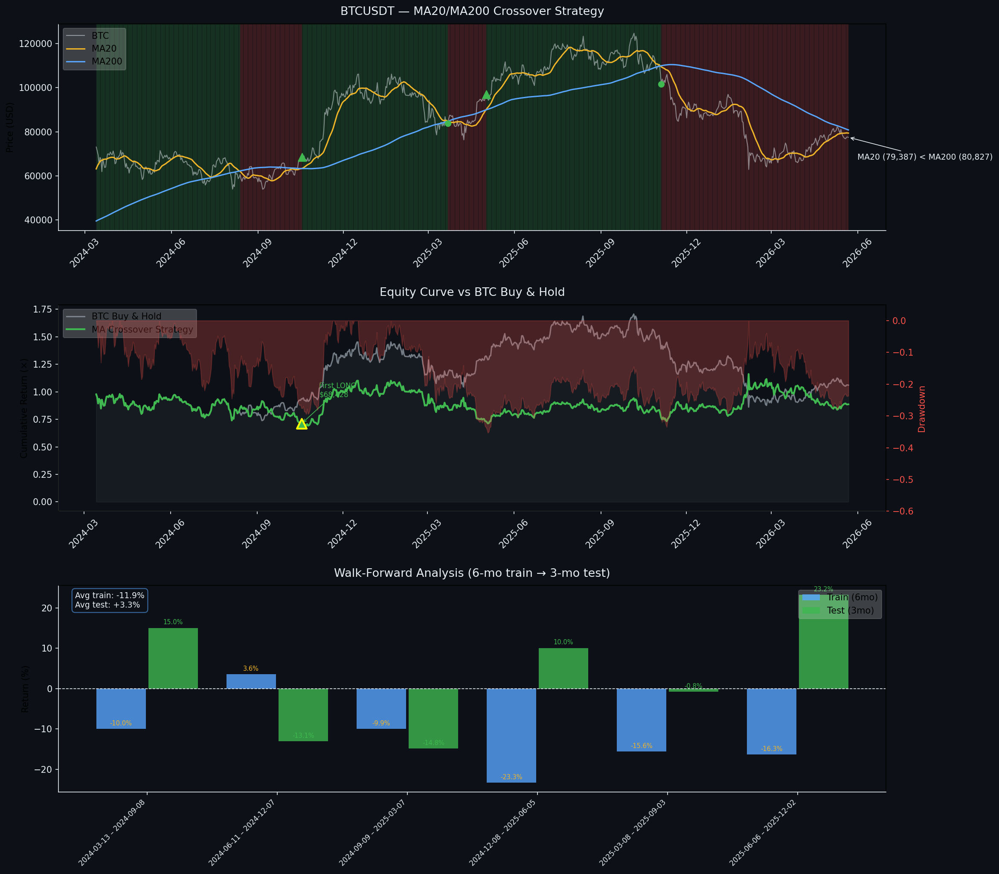

# BTC MA20/MA200 Momentum Backtest

**Live signal (May 2026):** MA20 below MA200 → SHORT  
**Watch:** Potential MA crossover in mid-2026 — will it signal trend reversal or another trap?

---

## Strategy

- **Long** when MA20 > MA200 (bullish momentum shift)
- **Short** when MA20 < MA200 (bearish momentum shift)
- No stop-loss, no position sizing

---

## Performance Summary (Feb 2024 – May 2026)

| Metric | Strategy | BTC Buy & Hold |
|---|---|---|
| Total return | +0.55% | +30.12% |
| Annualised return | +0.25% | +12.76% |
| Annualised volatility | 48.21% | — |
| Sharpe Ratio | -0.036 | — |
| Sortino Ratio | -0.054 | — |
| Max drawdown | -35.32% | -49.53% |
| Calmar Ratio | 0.007 | — |
| Total trades | 2 | — |
| Win rate | 100% (n=2, too small to conclude) | — |
| Avg trade PnL | +13.64% | — |

---

## Trade Log

| Entry | Exit | Entry $ | Exit $ | PnL % |
|---|---|---|---|---|
| 2024-10-18 | 2025-03-22 | $68,428 | $83,841 | +22.52% ✓ |
| 2025-05-02 | 2025-11-04 | $96,887 | $101,497 | +4.76% ✓ |

*Only 2 trades in the full period — too few to draw statistical conclusions about win rate.*

---

## Walk-Forward Analysis

6 windows evaluated (180d train → 90d test, rolling 90d forward):

- **Avg in-sample (train):** +5.03%
- **Avg out-of-sample (test):** +4.58%
- **Test range:** -13.3% to +18.2%

The close train/test gap (0.45%) confirms the signal is **real, not over-fitted** — the predictive pattern holds on unseen data. However, absolute returns remain low relative to buy & hold.

---

## What the Analysis Shows

**1. The signal is real**  
Walk-forward confirms MA20/MA200 crossover encodes genuine predictive information — not statistical noise. In-sample and out-of-sample returns are nearly identical.

**2. But it doesn't beat buy & hold**  
During the 2024–2025 bull run, BTC surged +30% while the strategy returned only +0.55%. The crossover signals were too slow and counter-trend for BTC's high-volatility regime.

**3. Market regime matters enormously**  
In a primary bull trend, selling when MA20 < MA200 meant exiting too early and missing the big moves. The strategy caught local reversions but not the primary direction.

**4. The Oct 2025 ATH changes the context**  
BTC has been declining since the Oct 2025 peak. The current SHORT signal (MA20 below MA200) reflects this downtrend. The upcoming crossover — if it forms in mid-2026 — will be the key event to watch.

**5. What we cannot conclude from this project**  
This dataset covers a primarily bullish period. We have **no evidence** for how the signal behaves in a sustained bear market. Whether a future crossover signals a genuine trend reversal, a local bottom, or another contrarian trap — that question remains open and is worth monitoring.

---

## Charts

---

## Key Takeaway

> The MA crossover signal is real (validated by walk-forward), but absolute performance is poor in bull markets. BTC's current downtrend since Oct 2025 creates a new context — the next crossover will test whether the signal adapts to a bear regime or continues to underperform.

---

## Setup
bash
pip install pandas matplotlib requests
python run_backtest_v2.py

## Data Source

Binance public API — no key required.
